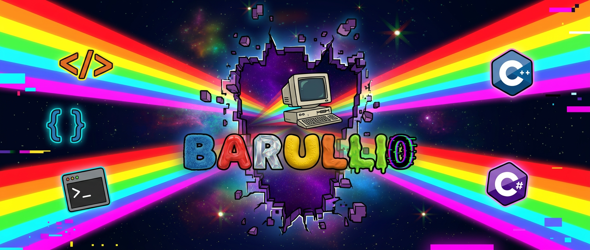

## // Loading developer... █████████░ 99% — never fully done.

⚠️ Advertencia: repositorio en llamas ⚠️

Hola, soy Barullo. Programador en construcción,
experto en Stack Overflow y maestro del Ctrl+Z.

Hablo SQL cuando quiero sentirme inteligente,
CSS cuando quiero sufrir,
C# cuando directamente odio mi vida
y HTML cuando necesito escribir 300 líneas
para mostrar un botón que no funciona.

El código funciona. No sé por qué. No preguntes.
## programming language

